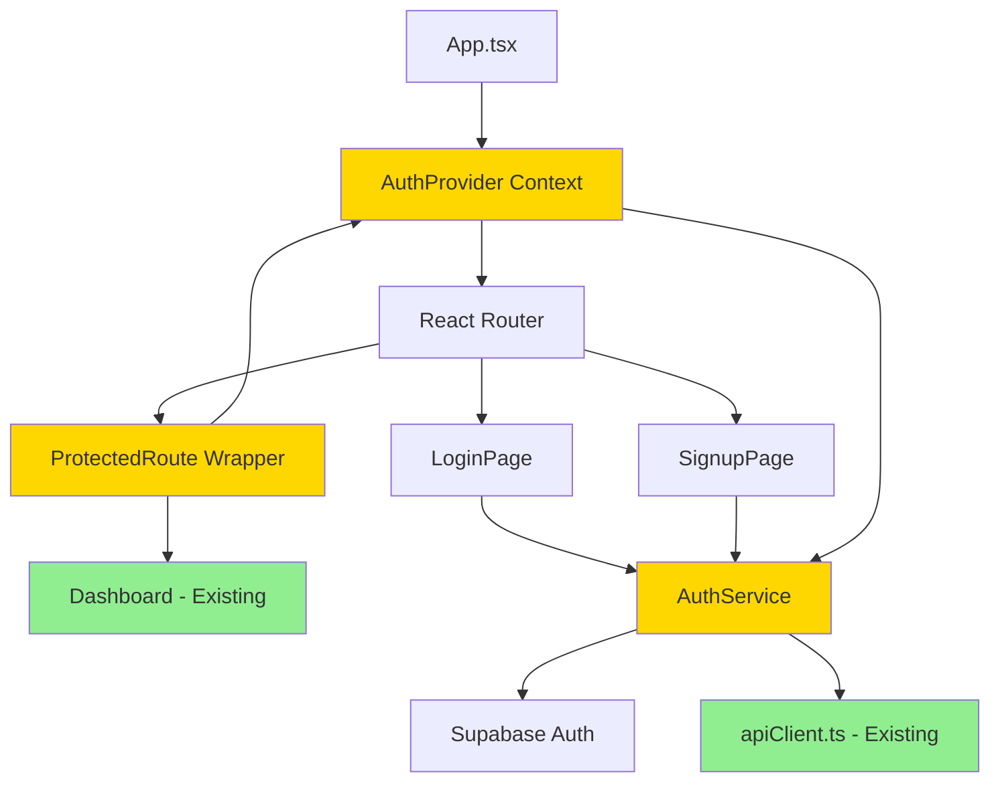

# Archon V2 Beta - Brownfield Enhancement Architecture
## Frontend Authentication System

**Document Version:** 1.0
**Created:** October 28, 2025
**Author:** Winston (Architect Agent)
**Enhancement:** User Authentication System
**Project:** Archon V2 Beta - Knowledge Management Platform

---

## Change Log

| Change | Date | Version | Description | Author |
|--------|------|---------|-------------|--------|
| Initial Architecture | 2025-10-28 | 1.0 | Brownfield authentication enhancement architecture | Winston (Architect) |

---

## 1. Introduction

Este documento define a arquitetura para adicionar **Sistema de Autenticação de Usuários** ao Archon V2 Beta, uma plataforma de gerenciamento de conhecimento com capacidades de IA. Esta melhoria transforma o Archon de um sistema local sem autenticação para uma aplicação multi-usuário segura, mantendo compatibilidade com o modelo de deployment local-first.

**Relationship to Existing Architecture:**
Este documento complementa a arquitetura atual do Archon (documentada em `PRPs/ai_docs/ARCHITECTURE.md`) definindo como os novos componentes de autenticação serão integrados. Em casos de conflito entre padrões novos e existentes, este documento fornece orientação para manter consistência durante a implementação.

### 1.1 Existing Project Analysis

#### Current Project State

Baseado na análise profunda do código-fonte, documentação e configurações:

- **Primary Purpose:** Plataforma de gerenciamento de conhecimento com RAG (Retrieval-Augmented Generation), crawling web, e integração MCP para IDEs de IA
- **Current Tech Stack:**
  - **Frontend:** React 18.3, TypeScript 5.5, TanStack Query v5, Tailwind CSS, Vite 5.4
  - **Backend:** Python 3.12, FastAPI 0.115, Supabase Client (PostgreSQL + pgvector)
  - **Infrastructure:** Docker Compose (com suporte recente a Kubernetes via ArgoCD)
  - **AI/ML:** PydanticAI, OpenAI Embeddings, FastMCP (Model Context Protocol)
- **Architecture Style:**
  - Frontend: Vertical slice architecture com feature folders
  - Backend: Service-oriented architecture com thin API routes
  - Data Fetching: TanStack Query com smart polling (visibility-aware)
- **Deployment Method:**
  - Primary: Docker Compose (3 serviços: archon-server:8181, archon-mcp:8051, archon-ui:3737)
  - New: Kubernetes manifests em `k8s-argocd/` para deployment via ArgoCD

#### Available Documentation

Documentos existentes consultados durante a análise:

- **`CLAUDE.md`** - Beta development guidelines (fail-fast philosophy, error handling, code quality standards)
- **`code-review.md`** - Code review recente (MCP health endpoint, Kubernetes support)
- **`PRPs/ai_docs/ARCHITECTURE.md`** - Visão geral da arquitetura atual (componentes, módulos, API structure)
- **`PRPs/ai_docs/DATA_FETCHING_ARCHITECTURE.md`** - TanStack Query patterns, query key factories, smart polling
- **`PRPs/ai_docs/QUERY_PATTERNS.md`** - Padrões de query hooks, stale times, optimistic updates
- **`PRPs/ai_docs/ETAG_IMPLEMENTATION.md`** - ETag caching (~70% bandwidth reduction)
- **`PRPs/ai_docs/API_NAMING_CONVENTIONS.md`** - RESTful patterns, service methods, type naming
- **`docs/prd/epic-1-frontend-authentication.md`** - Epic de autenticação com stories e acceptance criteria
- **`docker-compose.yml`** - Service configuration e environment variables
- **`.env.example`** - Required environment variables (SUPABASE_URL, SUPABASE_SERVICE_KEY)

#### Identified Constraints

Limitações e requisitos críticos identificados na análise:

- **Beta Development Constraint:** Sistema segue princípio "fail fast and loud" - erros devem ser detalhados, não silenciosos
- **Local-First Model:** Deployment local deve permanecer funcional (auth deve ser opcional via feature flag)
- **Backward Compatibility:** Schema changes devem ser backward compatible (user_id nullable, service-key bypass)
- **Zero Breaking Changes:** APIs existentes não podem ser quebradas - apenas adicionar camada de auth
- **Performance Budget:** JWT validation deve adicionar <50ms de latency
- **RLS Already Enabled:** Row Level Security já habilitada no Supabase, precisa apenas de policies atualizadas
- **CORS Configuration:** Atualmente `allow_origins=["*"]` - precisa ser ajustado com auth
- **Service Discovery:** Sistema já suporta múltiplos ambientes (Docker Compose, Kubernetes) via `SERVICE_DISCOVERY_MODE`
- **Kubernetes Readiness:** Recentemente adicionado suporte K8s, health checks via HTTP `/health` endpoint

---

## 2. Enhancement Scope and Integration Strategy

### 2.1 Enhancement Overview

**Enhancement Type:** Additive Feature Layer (Non-Breaking)

**Scope:** Adicionar sistema de autenticação de usuários como camada **opcional** sobre a arquitetura existente. O sistema continua funcionando exatamente como está quando autenticação está desabilitada. Quando habilitada, adiciona:
- Frontend: Login/Signup UI + Auth context + Protected routes
- Backend: JWT validation middleware (opcional por endpoint)
- Database: Colunas `user_id` nullable + RLS policies (opcionais quando service-key usado)

**Integration Impact:** **Minimal (Low Risk)**
- **Código Existente:** Zero modificações em funcionalidades atuais
- **APIs Existentes:** Mantidas 100% iguais, apenas adicionam suporte a header `Authorization` opcional
- **Database:** Schema changes são aditivos (ADD COLUMN nullable), não modificam dados existentes
- **Deployment:** Feature flag `AUTH_ENABLED` controla ativação (default: false para compatibilidade)

### 2.2 Integration Approach

#### Code Integration Strategy

**Pattern:** Decorator/Wrapper Pattern (Non-Invasive)

**Frontend:**
```typescript
// Sistema EXISTENTE permanece intocado
<App>
  <Router>
    <KnowledgePage />  {/* Funciona como sempre funcionou */}
  </Router>
</App>

// Sistema COM AUTH adiciona wrapper opcional
<App>
  <AuthProvider>  {/* ← Nova camada OPCIONAL */}
    <Router>
      <ProtectedRoute>  {/* ← Wrapper condicional */}
        <KnowledgePage />  {/* Componente original INALTERADO */}
      </ProtectedRoute>
    </Router>
  </AuthProvider>
</App>
```

**Backend:**
```python
# Rota EXISTENTE permanece intocada
@app.get("/api/projects")
async def list_projects():
    return project_service.list_projects()

# Rota COM AUTH adiciona decorator opcional
@app.get("/api/projects")
@optional_auth  # ← Decorator NÃO quebra se auth desabilitado
async def list_projects(user_id: Optional[str] = None):
    return project_service.list_projects(user_id)
```

**Principle:** Auth é uma **camada interceptadora** que pode ser ligada/desligada sem afetar código core.

#### Database Integration

**Strategy:** Additive Schema Changes (Backward Compatible)

**Approach:**
- `user_id UUID` columns são **nullable** (podem ser NULL para dados legacy)
- RLS policies usam `auth.uid() IS NULL OR auth.uid() = user_id` (permite acesso sem auth)
- Service-key requests bypassam RLS completamente (comportamento atual mantido)

**Migration Pattern:**
```sql
-- Adiciona colunas SEM quebrar dados existentes
ALTER TABLE archon_projects ADD COLUMN user_id UUID;
-- Dados existentes ficam com user_id = NULL (válido)

-- RLS policies permitem acesso legacy
CREATE POLICY "users_own_projects" ON archon_projects
  FOR ALL USING (
    auth.uid() IS NULL            -- ← Permite requests sem auth
    OR auth.uid() = user_id       -- ← Isola dados por user quando auth ativo
    OR current_setting('request.jwt.claim.role', true) = 'service_role'  -- ← Service-key bypass
  );
```

#### API Integration

**Strategy:** Opt-in Authentication Headers

**Current Behavior (Maintained):**
```bash
# Request SEM auth (funciona como sempre funcionou)
GET /api/projects
# Response: todos os projects
```

**New Behavior (When auth enabled):**
```bash
# Request COM auth (adiciona header opcional)
GET /api/projects
Authorization: Bearer <jwt_token>
# Response: projects do user autenticado

# Request SEM auth (ainda funciona - fallback para comportamento legacy)
GET /api/projects
# Response: projects públicos ou erro 401 (configurável)
```

**API Compatibility Matrix:**

| Endpoint | Auth Disabled | Auth Enabled + Token | Auth Enabled + No Token |
|----------|---------------|----------------------|-------------------------|
| `/api/projects` | ✅ All data | ✅ User data | ⚠️ Configurable (401 ou public data) |
| `/api/health` | ✅ Public | ✅ Public | ✅ Public (sempre público) |
| `/mcp/*` | ✅ Service-key | ✅ Service-key | ✅ Service-key (bypass auth) |

#### UI Integration

**Strategy:** Conditional Rendering (Feature Flag)

**Existing UI Flow (Maintained when AUTH_ENABLED=false):**
```
Browser → http://localhost:3737 → Dashboard (direto, sem login)
```

**New UI Flow (When AUTH_ENABLED=true):**
```
Browser → http://localhost:3737
  ↓
AuthProvider verifica sessão
  ├─ Sem sessão → Redirect /login
  └─ Com sessão → Dashboard (como sempre)
```

### 2.3 Compatibility Requirements

**Compatibility Guarantees:**

| Requirement | Implementation | Status |
|-------------|----------------|--------|
| **Existing API contracts unchanged** | Todos endpoints mantêm mesma signature | ✅ Garantido |
| **Database schema backward compatible** | `user_id` nullable, RLS com fallback | ✅ Garantido |
| **UI/UX consistency** | Novos componentes seguem design system existente | ✅ Garantido |
| **Performance impact minimal** | JWT validation <50ms, ETag caching mantido | ✅ Target definido |
| **Local deployment mode functional** | `AUTH_ENABLED=false` mantém comportamento atual | ✅ Garantido |
| **Service-key access preserved** | MCP/Agents bypassam auth, mantêm acesso total | ✅ Garantido |
| **Zero breaking changes** | Feature flag permite rollback instantâneo | ✅ Garantido |

---

## 3. Tech Stack

### 3.1 Existing Technology Stack

Todas as tecnologias abaixo serão **mantidas** e **não modificadas**. A feature de autenticação integra com o stack existente.

| Category | Current Technology | Version | Usage in Enhancement | Notes |
|----------|-------------------|---------|----------------------|-------|
| **Frontend Framework** | React | 18.3.1 | Auth UI components, context providers | Mantido - componentes auth seguem padrões React existentes |
| **Frontend Language** | TypeScript | 5.5.3 | Type-safe auth interfaces e hooks | Mantido - auth types adicionados sem modificar tipos existentes |
| **Frontend Build Tool** | Vite | 5.4.2 | Build auth components com resto da aplicação | Mantido - sem mudanças em vite.config.ts |
| **Frontend Styling** | Tailwind CSS | 3.4.10 | Estilização de Login/Signup UI | Mantido - auth UI usa classes existentes do design system |
| **State Management** | TanStack Query | v5.56.2 | Auth state management (session, user queries) | Mantido - auth usa mesmo padrão de query keys |
| **Frontend Router** | React Router | 6.26.1 | Protected routes, auth redirects | Mantido - adiciona rotas /login e /signup |
| **UI Components** | Radix UI | Various | Auth form primitives (Input, Button, Dialog) | Mantido - auth reutiliza componentes existentes |
| **Backend Framework** | FastAPI | 0.115.0 | JWT validation middleware, auth endpoints | Mantido - adiciona middleware sem modificar app core |
| **Backend Language** | Python | 3.12+ | Auth service layer, JWT utilities | Mantido - auth segue padrões Python existentes |
| **Database** | Supabase (PostgreSQL) | Latest | User auth storage, RLS policies | Mantido - adiciona tabelas auth via Supabase Auth |
| **Vector Database** | pgvector | Latest | Não afetado pela feature auth | Mantido - embeddings continuam funcionando igual |
| **AI/ML** | PydanticAI | Latest | Não afetado pela feature auth | Mantido - agents continuam funcionando igual |
| **MCP Server** | FastMCP | 1.12.2 | Service-key bypass de auth | Mantido - MCP tools não precisam de JWT |
| **Container Runtime** | Docker | Latest | Auth services rodando em containers | Mantido - mesmo docker-compose.yml com env vars adicionais |
| **Orchestration** | Kubernetes | 1.28+ | Auth secrets via ConfigMaps/Secrets | Mantido - manifestos K8s adicionados em k8s-argocd/ |
| **CD Tool** | ArgoCD | Latest | Deploy auth feature via GitOps | Mantido - ArgoCD aplica manifestos K8s |
| **Testing (Frontend)** | Vitest | Latest | Auth component tests | Mantido - testes auth seguem mesmo padrão |
| **Testing (Backend)** | pytest | Latest | Auth middleware e RLS policy tests | Mantido - testes auth usam fixtures existentes |
| **Linting (Frontend)** | ESLint + Biome | Latest | Auth code linting | Mantido - auth code segue mesmas rules |
| **Linting (Backend)** | Ruff + MyPy | Latest | Auth code type checking | Mantido - auth code 100% type-safe |

### 3.2 New Technology Additions

**Only 2 new dependencies** will be added to implement authentication:

| Technology | Version | Purpose | Rationale | Integration Method |
|-----------|---------|---------|-----------|-------------------|
| **@supabase/supabase-js** | ^2.45.4 | Supabase Auth SDK para frontend (login, signup, session management) | Supabase já é nosso database provider. Usar Supabase Auth evita adicionar Auth0, Firebase ou serviço third-party. Auth tables já existem no Supabase project. | `npm install @supabase/supabase-js` em archon-ui-main. Instanciar cliente auth em `features/auth/services/authService.ts` |
| **python-jose[cryptography]** | ^3.3.0 | JWT validation e decoding no backend Python | FastAPI não tem JWT built-in. `python-jose` é a biblioteca recomendada pela FastAPI docs para JWT RS256/HS256. Leve (<1MB), mature, bem mantida. | `uv add python-jose[cryptography]` em python/. Usado em `middleware/auth_middleware.py` |

---

## 4. Data Models and Schema Changes

### 4.1 New Data Models

#### User Model (Managed by Supabase Auth)

**Purpose:** Armazena informações de autenticação de usuários
**Integration:** Supabase Auth cria automaticamente a tabela `auth.users` - não precisamos gerenciar

**Key Attributes:**
- `id`: UUID - Primary key (gerado por Supabase)
- `email`: TEXT - Email único do usuário
- `encrypted_password`: TEXT - Password hash (gerenciado por Supabase)
- `email_confirmed_at`: TIMESTAMP - Timestamp de confirmação de email
- `created_at`: TIMESTAMP - Data de criação da conta
- `updated_at`: TIMESTAMP - Última atualização

**Relationships:**
- **With Existing:** `user_id` columns em tables existentes referenciarão `auth.users.id`
- **With New:** Nenhuma nova tabela além das fornecidas por Supabase Auth

### 4.2 Schema Integration Strategy

**Database Changes Required:**

#### New Columns Added to Existing Tables

```sql
-- archon_projects table
ALTER TABLE archon_projects
ADD COLUMN user_id UUID REFERENCES auth.users(id) ON DELETE SET NULL;

-- archon_tasks table
ALTER TABLE archon_tasks
ADD COLUMN user_id UUID REFERENCES auth.users(id) ON DELETE SET NULL;

-- archon_sources table (knowledge base sources)
ALTER TABLE archon_sources
ADD COLUMN user_id UUID REFERENCES auth.users(id) ON DELETE SET NULL;

-- archon_crawled_pages table
ALTER TABLE archon_crawled_pages
ADD COLUMN user_id UUID REFERENCES auth.users(id) ON DELETE SET NULL;

-- archon_code_examples table
ALTER TABLE archon_code_examples
ADD COLUMN user_id UUID REFERENCES auth.users(id) ON DELETE SET NULL;
```

**Key Design Decisions:**
- ✅ **Nullable columns:** Permite dados existentes (user_id=NULL) sem migração complexa
- ✅ **ON DELETE SET NULL:** Se user deletado, dados ficam órfãos mas não são removidos
- ✅ **Foreign key constraint:** Garante integridade referencial quando user_id presente

#### New Indexes for Performance

```sql
-- Index para queries "meus projetos"
CREATE INDEX idx_projects_user_id ON archon_projects(user_id) WHERE user_id IS NOT NULL;

-- Index para queries "minhas tasks"
CREATE INDEX idx_tasks_user_id ON archon_tasks(user_id) WHERE user_id IS NOT NULL;

-- Index para queries "minhas sources"
CREATE INDEX idx_sources_user_id ON archon_sources(user_id) WHERE user_id IS NOT NULL;
```

**Performance Impact:** Queries com `WHERE user_id = $1` serão otimizadas via index, <10ms overhead.

#### Updated RLS Policies

```sql
-- Projects table RLS
DROP POLICY IF EXISTS "Users can view all projects" ON archon_projects;

CREATE POLICY "users_own_projects" ON archon_projects
  FOR ALL USING (
    -- Permite acesso sem auth (backward compatibility)
    auth.uid() IS NULL
    -- Ou user é dono do projeto
    OR auth.uid() = user_id
    -- Ou é service_role key (MCP, agents)
    OR current_setting('request.jwt.claim.role', true) = 'service_role'
  );

-- Tasks table RLS
DROP POLICY IF EXISTS "Users can view all tasks" ON archon_tasks;

CREATE POLICY "users_own_tasks" ON archon_tasks
  FOR ALL USING (
    auth.uid() IS NULL
    OR auth.uid() = user_id
    OR current_setting('request.jwt.claim.role', true) = 'service_role'
  );

-- Sources table RLS (similar pattern)
CREATE POLICY "users_own_sources" ON archon_sources
  FOR ALL USING (
    auth.uid() IS NULL
    OR auth.uid() = user_id
    OR current_setting('request.jwt.claim.role', true) = 'service_role'
  );
```

#### Migration Strategy

**Backward Compatibility Measures:**

1. **Existing Data Preservation:**
   - Todos dados existentes mantêm `user_id = NULL`
   - RLS policies permitem acesso a dados com `user_id = NULL` quando `auth.uid() IS NULL`
   - Zero data loss ou corruption

2. **Service-Key Access:**
   - Requests com `SUPABASE_SERVICE_KEY` set `current_setting('request.jwt.claim.role') = 'service_role'`
   - RLS policies bypassam user_id check para service_role
   - MCP server e agents mantêm acesso total

3. **Rollback Plan:**
   ```sql
   -- Rollback migration (se necessário)
   ALTER TABLE archon_projects DROP COLUMN user_id;
   ALTER TABLE archon_tasks DROP COLUMN user_id;
   ALTER TABLE archon_sources DROP COLUMN user_id;
   -- Restaura RLS policies antigas
   ```

---

## 5. Component Architecture

### 5.1 New Components

#### Component: AuthProvider (Context Provider)

**Responsibility:** Gerencia estado de autenticação global da aplicação

**Integration Points:**
- Wraps `<App>` component em `App.tsx`
- Fornece `AuthContext` para toda árvore de componentes
- Integra com `@supabase/supabase-js` para session management

**Key Interfaces:**
```typescript
interface AuthContextValue {
  user: User | null;
  session: Session | null;
  loading: boolean;
  signIn: (email: string, password: string) => Promise<void>;
  signUp: (email: string, password: string) => Promise<void>;
  signOut: () => Promise<void>;
  isAuthenticated: boolean;
}
```

**Dependencies:**
- **Existing Components:** Nenhum (é root-level provider)
- **New Components:** AuthService (service layer)

**Technology Stack:** React Context API, @supabase/supabase-js, TanStack Query (para caching de user data)

---

#### Component: LoginPage

**Responsibility:** UI para usuário fazer login com email/password

**Integration Points:**
- Route `/login` em React Router
- Redireciona para dashboard após login bem-sucedido
- Link para SignupPage

**Key Interfaces:**
```typescript
interface LoginFormData {
  email: string;
  password: string;
}
```

**Dependencies:**
- **Existing Components:** Radix UI Input, Button, Card components
- **New Components:** useAuth() hook

**Technology Stack:** React, TypeScript, Radix UI, React Hook Form, Zod (validation)

---

#### Component: SignupPage

**Responsibility:** UI para usuário criar conta com email/password

**Integration Points:**
- Route `/signup` em React Router
- Form validation com Zod schema
- Redireciona para dashboard após signup

**Key Interfaces:**
```typescript
interface SignupFormData {
  email: string;
  password: string;
  confirmPassword: string;
}
```

**Dependencies:**
- **Existing Components:** Radix UI components
- **New Components:** useAuth() hook

**Technology Stack:** React, TypeScript, React Hook Form, Zod validation

---

#### Component: ProtectedRoute

**Responsibility:** Wrapper component que protege rotas requerendo autenticação

**Integration Points:**
- Wraps rotas protegidas em React Router
- Redireciona para /login se usuário não autenticado
- Permite acesso se `AUTH_ENABLED=false` (backward compatibility)

**Key Interfaces:**
```typescript
interface ProtectedRouteProps {
  children: React.ReactNode;
  fallback?: React.ReactNode;
}
```

**Dependencies:**
- **Existing Components:** React Router `Navigate`
- **New Components:** useAuth() hook

**Technology Stack:** React, React Router, TanStack Query

---

#### Component: AuthService (Service Layer)

**Responsibility:** Abstração sobre Supabase Auth client para operações de autenticação

**Integration Points:**
- Usado por AuthProvider e auth hooks
- Integra com apiClient.ts para injetar tokens
- Persiste session no localStorage (configurável)

**Key Interfaces:**
```typescript
interface AuthService {
  signIn(email: string, password: string): Promise<AuthResponse>;
  signUp(email: string, password: string): Promise<AuthResponse>;
  signOut(): Promise<void>;
  getSession(): Promise<Session | null>;
  refreshSession(): Promise<Session>;
  onAuthStateChange(callback: (session: Session | null) => void): Unsubscribe;
}
```

**Dependencies:**
- **Existing Components:** apiClient.ts (para adicionar interceptor)
- **New Components:** @supabase/supabase-js client

**Technology Stack:** TypeScript, @supabase/supabase-js

---

### 5.2 Component Interaction Diagram



**Legend:**
- 🟢 Green: Existing components (unchanged)
- 🟡 Yellow: New auth components

---

## 6. API Design and Integration

### 6.1 API Integration Strategy

**API Integration Strategy:** Opt-in JWT validation via middleware decorator

**Authentication:** Supabase JWT tokens (RS256) validated via public key

**Versioning:** No API versioning needed - auth is additive, não quebra existing contracts

### 6.2 New API Endpoints

#### Endpoint: POST /api/auth/session

**Method:** POST
**Endpoint:** `/api/auth/session`
**Purpose:** Valida JWT token e retorna user info (usado pelo frontend para verificar sessão)

**Integration:** Novo endpoint que não afeta rotas existentes

**Request:**
```json
{
  "token": "eyJhbGciOiJSUzI1NiIsInR5cCI6IkpXVCJ9..."
}
```

**Response:**
```json
{
  "user": {
    "id": "550e8400-e29b-41d4-a716-446655440000",
    "email": "user@example.com",
    "created_at": "2025-10-28T12:00:00Z"
  },
  "valid": true
}
```

---

#### Endpoint: POST /api/auth/refresh

**Method:** POST
**Endpoint:** `/api/auth/refresh`
**Purpose:** Refresh JWT token antes de expirar (handled by Supabase client, endpoint para debug)

**Integration:** Opcional - Supabase client faz refresh automático

**Request:**
```json
{
  "refresh_token": "v1.MR5S0vJBYue..."
}
```

**Response:**
```json
{
  "access_token": "eyJhbGciOiJSUzI1NiIsInR5cCI6IkpXVCJ9...",
  "refresh_token": "v1.NEW_REFRESH_TOKEN...",
  "expires_in": 3600
}
```

---

### 6.3 Modified Existing Endpoints (Backward Compatible)

Todos endpoints existentes **mantêm mesma signature** mas adicionam suporte opcional a `Authorization` header.

**Pattern Example:**

```python
# Before (existing behavior preserved)
@app.get("/api/projects")
async def list_projects():
    # Returns all projects
    return project_service.list_projects()

# After (auth-aware but backward compatible)
@app.get("/api/projects")
@optional_auth  # Decorator injeta user_id se token presente
async def list_projects(user_id: Optional[str] = None):
    # Returns user projects se user_id presente, senão all projects
    return project_service.list_projects(user_id=user_id)
```

**Affected Endpoints:**
- `GET /api/projects` - Filtra por user_id quando presente
- `POST /api/projects` - Seta user_id automaticamente quando auth ativo
- `GET /api/tasks` - Filtra tasks por user_id
- `GET /api/knowledge/sources` - Filtra sources por user_id
- `GET /api/progress/active` - Filtra operações por user_id

**Unchanged Endpoints (Always Public):**
- `GET /api/health` - Health check sempre público
- `GET /api/docs` - API documentation sempre pública
- `POST /mcp/*` - MCP tools usam service-key, não JWT

---

## 7. Source Tree

### 7.1 Existing Project Structure

```
archon-ui-main/src/
├── features/
│   ├── knowledge/          # Existing - Knowledge management
│   ├── projects/           # Existing - Project/task management
│   ├── mcp/                # Existing - MCP integration
│   ├── progress/           # Existing - Progress tracking
│   ├── shared/             # Existing - Shared utilities
│   └── ui/                 # Existing - UI components
├── pages/                  # Existing - Route pages
└── App.tsx                 # Existing - Main app entry

python/src/server/
├── api_routes/             # Existing - API endpoints
├── services/               # Existing - Business logic
├── middleware/             # Existing - CORS, logging
├── config/                 # Existing - Configuration
└── utils/                  # Existing - Utilities
```

### 7.2 New File Organization

```
archon-ui-main/src/
├── features/
│   ├── knowledge/          # Existing folder
│   ├── projects/           # Existing folder
│   ├── auth/               # ← NEW: Auth feature slice
│   │   ├── components/     # Login, Signup, ProtectedRoute
│   │   │   ├── LoginPage.tsx
│   │   │   ├── SignupPage.tsx
│   │   │   ├── ProtectedRoute.tsx
│   │   │   └── PasswordResetForm.tsx
│   │   ├── hooks/          # Auth-specific hooks
│   │   │   ├── useAuth.ts
│   │   │   ├── useSession.ts
│   │   │   └── useAuthQueries.ts  # TanStack Query keys
│   │   ├── services/       # Auth service layer
│   │   │   ├── authService.ts     # Supabase Auth wrapper
│   │   │   └── authApi.ts         # Backend API calls
│   │   ├── context/        # Auth context provider
│   │   │   ├── AuthContext.tsx
│   │   │   └── AuthProvider.tsx
│   │   └── types/          # Auth TypeScript types
│   │       └── index.ts
│   ├── shared/             # Existing folder
│   │   ├── api/
│   │   │   └── apiClient.ts       # MODIFIED: Add token interceptor
│   │   └── hooks/          # Existing hooks
│   └── ui/                 # Existing folder
├── pages/
│   ├── KnowledgePage.tsx   # Existing page
│   ├── ProjectsPage.tsx    # Existing page
│   └── AuthPages.tsx       # ← NEW: Auth routes (/login, /signup)
└── App.tsx                 # MODIFIED: Wrap with AuthProvider

python/src/server/
├── api_routes/
│   ├── knowledge_api.py    # Existing file
│   ├── projects_api.py     # Existing file
│   └── auth_api.py         # ← NEW: Auth endpoints
├── services/
│   ├── knowledge/          # Existing folder
│   ├── projects/           # Existing folder
│   └── auth/               # ← NEW: Auth services
│       ├── jwt_service.py       # JWT validation
│       ├── auth_service.py      # Auth business logic
│       └── user_service.py      # User data operations
├── middleware/
│   ├── cors.py             # Existing file
│   ├── logging.py          # Existing file
│   └── auth_middleware.py  # ← NEW: JWT validation middleware
└── utils/
    └── jwt_utils.py        # ← NEW: JWT helper functions

k8s-argocd/                 # Existing folder
├── base/                   # Existing manifests
└── overlays/
    └── production/
        ├── secrets.yaml    # ← NEW: Auth secrets (JWT_SECRET)
        └── configmap.yaml  # MODIFIED: Add AUTH_ENABLED flag
```

### 7.3 Integration Guidelines

**File Naming:**
- Auth components: `{Purpose}Page.tsx` ou `{Purpose}Form.tsx` (segue padrão existente)
- Auth services: `{domain}Service.ts` (segue padrão service layer)
- Auth middleware: `auth_middleware.py` (segue snake_case Python)

**Folder Organization:**
- Auth feature em `features/auth/` (vertical slice como outras features)
- Auth services backend em `services/auth/` (separado por domínio)
- K8s manifests auth em `k8s-argocd/overlays/` (environment-specific)

**Import/Export Patterns:**
```typescript
// Frontend barrel exports (seguindo padrão existente)
// features/auth/index.ts
export { AuthProvider } from './context/AuthProvider';
export { useAuth } from './hooks/useAuth';
export { ProtectedRoute } from './components/ProtectedRoute';
export * from './types';

// Backend imports (seguindo padrão existente)
# python/src/server/services/auth/__init__.py
from .jwt_service import validate_jwt_token
from .auth_service import authenticate_user
from .user_service import get_user_by_id

__all__ = ['validate_jwt_token', 'authenticate_user', 'get_user_by_id']
```

---

## 8. Infrastructure and Kubernetes Deployment

### 8.1 Existing Infrastructure

**Current Deployment:** Docker Compose (local development e production local-first)

**Infrastructure Tools:**
- Docker 24.x
- Docker Compose 2.x
- Kubernetes 1.28+ (recentemente adicionado)
- ArgoCD Latest (GitOps para K8s)

**Environments:**
- Local Development (docker-compose.yml)
- Kubernetes Production (k8s-argocd/ manifests)

### 8.2 Enhancement Deployment Strategy

**Deployment Approach:** Gradual rollout com feature flag

**Phases:**
1. **Phase 1 - Development:** Deploy com `AUTH_ENABLED=false` (default, sem impacto)
2. **Phase 2 - Testing:** Habilitar auth em ambiente de test para validar integração
3. **Phase 3 - Production:** Gradualmente habilitar auth via feature flag

**Infrastructure Changes:**

#### Docker Compose Changes

**File:** `docker-compose.yml`

```yaml
services:
  archon-server:
    environment:
      # Existing env vars (mantidos)
      - SUPABASE_URL=${SUPABASE_URL}
      - SUPABASE_SERVICE_KEY=${SUPABASE_SERVICE_KEY}

      # NEW: Auth feature flag
      - AUTH_ENABLED=${AUTH_ENABLED:-false}  # Default false para backward compatibility

      # NEW: JWT configuration
      - JWT_SECRET=${JWT_SECRET}  # For HS256 tokens (optional, Supabase usa RS256)
      - JWT_ALGORITHM=${JWT_ALGORITHM:-RS256}
      - SUPABASE_JWT_SECRET=${SUPABASE_JWT_SECRET}  # Supabase project JWT secret

  archon-ui:
    environment:
      # NEW: Frontend feature flag
      - VITE_AUTH_ENABLED=${AUTH_ENABLED:-false}

      # Existing vars (mantidos)
      - VITE_API_URL=${VITE_API_URL:-http://localhost:8181}
```

#### Kubernetes Manifests (NEW)

**File:** `k8s-argocd/base/auth-secret.yaml`

```yaml
apiVersion: v1
kind: Secret
metadata:
  name: archon-auth-secrets
  namespace: archon
type: Opaque
stringData:
  jwt-secret: ""  # Populated via Sealed Secrets ou External Secrets Operator
  supabase-jwt-secret: ""  # Supabase project JWT secret
```

**File:** `k8s-argocd/overlays/production/configmap.yaml` (MODIFIED)

```yaml
apiVersion: v1
kind: ConfigMap
metadata:
  name: archon-config
  namespace: archon
data:
  # Existing config (mantido)
  SERVICE_DISCOVERY_MODE: "kubernetes"
  API_SERVICE_URL: "http://archon-server.archon.svc:8181"
  MCP_SERVICE_URL: "http://archon-mcp.archon.svc:8051"

  # NEW: Auth configuration
  AUTH_ENABLED: "true"  # Production tem auth habilitado
  JWT_ALGORITHM: "RS256"
```

**File:** `k8s-argocd/base/deployment.yaml` (MODIFIED)

```yaml
apiVersion: apps/v1
kind: Deployment
metadata:
  name: archon-server
spec:
  template:
    spec:
      containers:
      - name: archon-server
        env:
        # Existing env vars (mantidos)
        - name: SUPABASE_URL
          valueFrom:
            secretKeyRef:
              name: supabase-secret
              key: url

        # NEW: Auth env vars
        - name: AUTH_ENABLED
          valueFrom:
            configMapKeyRef:
              name: archon-config
              key: AUTH_ENABLED

        - name: SUPABASE_JWT_SECRET
          valueFrom:
            secretKeyRef:
              name: archon-auth-secrets
              key: supabase-jwt-secret
```

**Pipeline Integration:**

ArgoCD Application manifest permanece o mesmo. ArgoCD automaticamente detecta changes em `k8s-argocd/` e aplica.

**File:** `k8s-argocd/application.yaml` (EXISTING - sem mudanças necessárias)

```yaml
apiVersion: argoproj.io/v1alpha1
kind: Application
metadata:
  name: archon
  namespace: argocd
spec:
  project: default
  source:
    repoURL: https://github.com/your-org/archon
    targetRevision: main
    path: k8s-argocd/overlays/production
  destination:
    server: https://kubernetes.default.svc
    namespace: archon
  syncPolicy:
    automated:
      prune: true
      selfHeal: true
```

### 8.3 Rollback Strategy

**Rollback Method:**

1. **Instant Rollback (sem deploy):**
   ```bash
   # Disable auth via ConfigMap (ArgoCD aplica em segundos)
   kubectl patch configmap archon-config -n archon -p '{"data":{"AUTH_ENABLED":"false"}}'

   # Restart pods para aplicar change
   kubectl rollout restart deployment/archon-server -n archon
   ```

2. **Git Rollback (via ArgoCD):**
   ```bash
   # Revert commit que habilitou auth
   git revert <commit-hash>
   git push origin main

   # ArgoCD automaticamente faz rollback
   ```

**Risk Mitigation:**

- Feature flag permite disable instantâneo sem rollback de código
- Database schema changes são backward compatible (user_id nullable)
- RLS policies permitem acesso sem auth (`auth.uid() IS NULL`)
- Service-key requests bypassam auth completamente

**Monitoring:**

```yaml
# Prometheus metrics para monitorar auth
# File: k8s-argocd/base/servicemonitor.yaml (NEW)
apiVersion: monitoring.coreos.com/v1
kind: ServiceMonitor
metadata:
  name: archon-auth-metrics
spec:
  selector:
    matchLabels:
      app: archon-server
  endpoints:
  - port: metrics
    path: /metrics
```

**Metrics to track:**
- `archon_auth_requests_total{status="success|failure"}` - Auth attempts
- `archon_jwt_validation_duration_seconds` - JWT validation latency
- `archon_auth_enabled` - Feature flag state (0 ou 1)

---

## 9. Coding Standards

### 9.1 Existing Standards Compliance

**Code Style:**
- **Frontend:** ESLint + Biome (120 char lines, double quotes, trailing commas)
- **Backend:** Ruff + Black style (120 char lines, snake_case)

**Linting Rules:**
- **Frontend:** ESLint para legacy code, Biome para `/features` (auth vai para features/auth, usa Biome)
- **Backend:** Ruff check + Ruff format, MyPy para type checking

**Testing Patterns:**
- **Frontend:** Vitest + React Testing Library (auth tests em `features/auth/tests/`)
- **Backend:** pytest com async support (auth tests em `tests/server/auth/`)

**Documentation Style:**
- **Frontend:** JSDoc para funções públicas, inline comments para lógica complexa
- **Backend:** Python docstrings (Google style), type hints obrigatórias

### 9.2 Enhancement-Specific Standards

**Auth Code Security Standards:**

- **Never log sensitive data:** Passwords, tokens, secrets nunca devem aparecer em logs
  ```python
  # ❌ WRONG
  logger.info(f"User logged in with token: {token}")

  # ✅ CORRECT
  logger.info(f"User {user_id} logged in successfully")
  ```

- **Always use HTTPS in production:** JWT tokens devem ser transmitidos apenas via HTTPS
  ```typescript
  // Frontend apiClient deve verificar protocol em production
  if (import.meta.env.PROD && !window.location.protocol.startsWith('https')) {
    throw new Error('Auth requires HTTPS in production');
  }
  ```

- **Validate all inputs:** Email, password devem ser validados antes de enviar ao backend
  ```typescript
  // Use Zod schemas para validation
  const loginSchema = z.object({
    email: z.string().email('Invalid email format'),
    password: z.string().min(8, 'Password must be at least 8 characters')
  });
  ```

### 9.3 Critical Integration Rules

**Existing API Compatibility:**
- Todos endpoints devem manter mesma signature
- `Authorization` header é **opcional** - backend deve funcionar sem ele
- Nunca retornar erro se auth desabilitado via feature flag

**Database Integration:**
- `user_id` columns devem ser **nullable**
- Queries devem funcionar com `user_id = NULL` (dados legacy)
- Service-key requests devem bypassar RLS completamente

**Error Handling:**
- Seguir CLAUDE.md "fail fast and loud" philosophy
- JWT validation errors devem retornar 401 com mensagem clara
- Supabase Auth errors devem ser propagados ao frontend com contexto

**Logging Consistency:**
- Auth events devem usar mesmo logger que resto da aplicação
- Format: `[AUTH] {event} - user_id={id}, success={bool}`
- Exemplos:
  ```python
  logger.info(f"[AUTH] Login attempt - email={email}, success=True")
  logger.warning(f"[AUTH] Invalid token - user_id={user_id}, reason=expired")
  logger.error(f"[AUTH] JWT validation failed - error={str(e)}", exc_info=True)
  ```

---

## 10. Testing Strategy

### 10.1 Integration with Existing Tests

**Existing Test Framework:**
- **Frontend:** Vitest 1.6+ com React Testing Library
- **Backend:** pytest 8.x com pytest-asyncio

**Test Organization:**
- **Frontend:** `src/features/{feature}/tests/` (co-located com código)
- **Backend:** `tests/server/{module}/` (espelhando src structure)

**Coverage Requirements:**
- **Frontend:** 80% coverage mínimo para features/auth/
- **Backend:** 90% coverage mínimo para services/auth/ e middleware/

### 10.2 New Testing Requirements

#### Unit Tests for New Components

**Framework:** Vitest + React Testing Library

**Location:** `archon-ui-main/src/features/auth/tests/`

**Coverage Target:** 85% minimum

**Integration with Existing:** Auth tests seguem mesmo padrão que tests existentes em features/projects/

**Example Test Files:**
```
features/auth/tests/
├── LoginPage.test.tsx          # UI tests
├── SignupPage.test.tsx         # Form validation tests
├── ProtectedRoute.test.tsx     # Route protection tests
├── useAuth.test.ts             # Hook tests
├── authService.test.ts         # Service layer tests
└── AuthProvider.test.tsx       # Context provider tests
```

**Key Test Scenarios:**
- ✅ Login com credenciais válidas
- ✅ Login com credenciais inválidas (401)
- ✅ Signup com dados válidos
- ✅ Signup com email duplicado (conflict)
- ✅ Protected route redireciona quando não autenticado
- ✅ Protected route permite acesso quando autenticado
- ✅ Token refresh automático antes de expirar
- ✅ Logout limpa session e redireciona

#### Backend Unit Tests

**Framework:** pytest + pytest-asyncio

**Location:** `python/tests/server/auth/`

**Coverage Target:** 90% minimum

**Integration with Existing:** Auth tests usam fixtures existentes para database e async client

**Example Test Files:**
```
tests/server/auth/
├── test_jwt_service.py         # JWT validation tests
├── test_auth_middleware.py     # Middleware integration tests
├── test_auth_api.py            # API endpoint tests
└── test_user_service.py        # User CRUD tests
```

**Key Test Scenarios:**
- ✅ JWT validation com token válido
- ✅ JWT validation com token expirado (401)
- ✅ JWT validation com token inválido (401)
- ✅ Middleware injeta user_id em request.state
- ✅ Middleware bypassa auth quando AUTH_ENABLED=false
- ✅ Service-key requests bypassam JWT validation
- ✅ RLS policies isolam dados por user_id

### 10.3 Integration Tests

**Scope:** End-to-end auth flow - Frontend → Backend → Database

**Existing System Verification:**
- ✅ Existing endpoints continuam funcionando sem auth header
- ✅ Existing data acessível quando user_id=NULL
- ✅ MCP server mantém acesso via service-key

**New Feature Testing:**
- ✅ User signup → email confirmation → login flow
- ✅ Protected route redirect → login → access granted
- ✅ Multi-user isolation (user A não vê dados de user B)

**Test Environment:**
```yaml
# docker-compose.test.yml
services:
  archon-server-test:
    environment:
      AUTH_ENABLED: "true"
      SUPABASE_URL: "http://supabase-test:8000"

  supabase-test:
    image: supabase/supabase:latest
    # Isolated test database
```

### 10.4 Regression Testing

**Existing Feature Verification:**

Run full test suite existente com `AUTH_ENABLED=false` e `AUTH_ENABLED=true` para garantir zero breaking changes.

**Automated Regression Suite:**
```bash
# Frontend regression
npm run test -- --coverage --run
npm run test:auth-disabled  # Custom script com AUTH_ENABLED=false
npm run test:auth-enabled   # Custom script com AUTH_ENABLED=true

# Backend regression
pytest tests/ --cov=src/server --cov-report=html
pytest tests/ --auth-disabled  # Custom marker
pytest tests/ --auth-enabled   # Custom marker
```

**Manual Testing Requirements:**
- ✅ Login flow completo (signup → login → dashboard)
- ✅ Protected routes funcionando
- ✅ Multi-user data isolation
- ✅ MCP server funcionando sem auth
- ✅ Existing features funcionando com auth disabled
- ✅ Rollback via feature flag funciona

---

## 11. Security Integration

### 11.1 Existing Security Measures

**Authentication:** Currently none - system operates local-only sem user accounts

**Authorization:** Supabase RLS enabled mas com policies públicas (`FOR ALL USING (true)`)

**Data Protection:**
- HTTPS em production (assumido, não forçado)
- SUPABASE_SERVICE_KEY em environment variables (não hardcoded)
- Passwords: N/A (sem users atualmente)

**Security Tools:**
- Dependabot para dependency updates (GitHub)
- Ruff security rules (backend linting)
- ESLint security plugin (frontend linting)

### 11.2 Enhancement Security Requirements

#### Authentication Security

**Password Requirements:**
- Minimum 8 characters
- Must contain uppercase, lowercase, number, special char (enforced por Supabase Auth)
- Password hashing via bcrypt (gerenciado por Supabase)

**JWT Token Security:**
- Algorithm: RS256 (RSA with SHA-256) - Supabase default
- Expiration: 3600 seconds (1 hour) - auto-refresh antes de expirar
- Claims: `sub` (user_id), `email`, `role`, `exp` (expiration)
- Signature verification: Via Supabase public key (`https://<project>.supabase.co/.well-known/jwks.json`)

**Session Management:**
- Storage: localStorage (default), configurable para sessionStorage
- Refresh token: Stored separately, rotated on refresh
- Session timeout: 7 days inactivity (Supabase default)

#### Authorization Security

**Integration Points:**

Backend middleware valida JWT e injeta `user_id`:
```python
# middleware/auth_middleware.py
async def auth_middleware(request: Request, call_next):
    token = request.headers.get("Authorization", "").replace("Bearer ", "")

    if not token:
        # No token - allow if AUTH_ENABLED=false
        if not settings.AUTH_ENABLED:
            return await call_next(request)
        # Auth required but no token - check if endpoint is public
        if is_public_endpoint(request.url.path):
            return await call_next(request)
        raise HTTPException(status_code=401, detail="Authentication required")

    # Validate JWT
    try:
        payload = validate_jwt_token(token)
        request.state.user_id = payload["sub"]
        request.state.user_email = payload["email"]
    except JWTExpiredError:
        raise HTTPException(status_code=401, detail="Token expired")
    except JWTInvalidError as e:
        raise HTTPException(status_code=401, detail=f"Invalid token: {str(e)}")

    return await call_next(request)
```

**RLS Policy Security:**

Supabase RLS garante data isolation no database level:
```sql
-- Exemplo: archon_projects table
CREATE POLICY "users_own_projects" ON archon_projects
  FOR ALL USING (
    -- Fallback para legacy data
    auth.uid() IS NULL
    -- User ownership
    OR auth.uid() = user_id
    -- Service-key bypass
    OR current_setting('request.jwt.claim.role', true) = 'service_role'
  );
```

**Compliance Requirements:**
- GDPR: User data deletion cascade (`ON DELETE CASCADE` em foreign keys)
- Data Export: API endpoint para user baixar todos seus dados
- Audit Log: Log de auth events (login, logout, token refresh)

### 11.3 Security Testing

**Existing Security Tests:** None specific to auth (não havia auth antes)

**New Security Test Requirements:**

```python
# tests/server/auth/test_security.py

async def test_jwt_expired_rejected():
    """Tokens expirados devem retornar 401"""
    expired_token = create_expired_jwt()
    response = await client.get("/api/projects", headers={"Authorization": f"Bearer {expired_token}"})
    assert response.status_code == 401

async def test_rls_isolates_user_data():
    """User A não deve ver dados de User B"""
    user_a_token = await login("usera@example.com", "password")
    user_b_token = await login("userb@example.com", "password")

    # User A cria projeto
    project = await create_project(user_a_token, {"title": "User A Project"})

    # User B tenta acessar projeto de A
    response = await client.get(f"/api/projects/{project.id}", headers={"Authorization": f"Bearer {user_b_token}"})
    assert response.status_code == 404  # RLS policy bloqueia

async def test_service_key_bypasses_auth():
    """Service-key requests devem bypassar JWT validation"""
    response = await client.get(
        "/api/projects",
        headers={"Authorization": f"Bearer {settings.SUPABASE_SERVICE_KEY}"}
    )
    assert response.status_code == 200
    # Deve retornar TODOS os projects (sem filtro user_id)
```

**Penetration Testing Requirements:**

Manual testing scenarios:
- ✅ SQL Injection via email/password inputs
- ✅ XSS via user-generated content (project titles, task descriptions)
- ✅ CSRF attacks (mitigated por SameSite cookies se usarmos)
- ✅ Session fixation attacks
- ✅ Brute force login attempts (rate limiting needed?)

---

## 12. Next Steps

### 12.1 Story Manager Handoff

**Prompt for Story Manager:**

"Please develop detailed user stories for the Frontend Authentication System epic. Key considerations:

**Integration Context:**
- This is an enhancement to Archon V2 Beta (React 18/FastAPI/Supabase stack)
- Integration points verified:
  - Frontend: apiClient.ts (token injection), App.tsx (AuthProvider wrapper)
  - Backend: main.py (middleware registration), api_routes/ (decorator @optional_auth)
  - Database: RLS policies with backward compatibility fallback
  - K8s: ConfigMaps for AUTH_ENABLED flag, Secrets for JWT keys

**Existing Patterns to Follow:**
- Vertical slice architecture in `/features/auth/`
- TanStack Query for auth state (session, user queries)
- Service layer pattern (authService.ts → auth_api.py → Supabase)
- Tron glassmorphism UI design system
- Testing with Vitest (frontend) and pytest (backend)

**Critical Compatibility Requirements:**
- Feature flag `AUTH_ENABLED=false` (default) maintains current behavior
- Nullable `user_id` columns for backward compatibility
- Service-key bypass for MCP server and agents
- Zero breaking changes to existing API contracts
- RLS policies with `auth.uid() IS NULL` fallback

**Each Story Must Include:**
- Acceptance criteria validating existing functionality remains intact
- Test scenarios covering auth disabled and enabled states
- Integration verification with actual codebase files (not assumptions)
- Clear sequencing to minimize risk to existing system

**First Story to Implement:**
Story 1 - Frontend Authentication Foundation (AuthContext, Supabase client, hooks)

The epic maintains system integrity while delivering secure multi-user authentication with user data isolation."

---

### 12.2 Developer Handoff

**Prompt for Developers:**

"Implementation guide for Frontend Authentication System enhancement.

**Architecture Reference:**
- This document (`docs/architecture.md`)
- Existing architecture: `PRPs/ai_docs/ARCHITECTURE.md`
- Coding standards analyzed from actual project files
- Beta philosophy: CLAUDE.md (fail fast and loud)

**Integration Requirements:**

✅ **Do's:**
- Use decorator/wrapper pattern - NEVER modify existing components directly
- Add `@optional_auth` to endpoints - maintain backward compatibility
- Follow vertical slice in `features/auth/` - reuse patterns from features/projects/
- Test with `AUTH_ENABLED=false` first - ensure no regressions
- Use TanStack Query keys from `authKeys` factory - follow queryPatterns.ts

❌ **Don'ts:**
- Don't break existing APIs - only ADD auth support
- Don't modify database data - user_id nullable preserves legacy data
- Don't skip service-key bypass - MCP/agents need system-level access
- Don't log sensitive data (passwords, tokens)
- Don't hardcode secrets - use environment variables

**Key Technical Decisions:**
- **JWT Validation:** RS256 via python-jose + Supabase public key
- **RLS Policies:** Backward compatible with `auth.uid() IS NULL OR ...`
- **Frontend State:** TanStack Query context (not Redux/Zustand)
- **K8s Secrets:** ConfigMaps for feature flags, Secrets for JWT keys

**Implementation Sequencing:**

1. **Backend First (Low Risk):**
   - Add `user_id` columns (nullable)
   - Implement JWT middleware with feature flag check
   - Update RLS policies with fallback
   - Test with `AUTH_ENABLED=false` - verify zero impact

2. **Frontend Core:**
   - Install `@supabase/supabase-js`
   - Create AuthProvider context
   - Implement authService.ts
   - Add token interceptor to apiClient.ts

3. **Frontend UI:**
   - Build Login/Signup pages (Tron glassmorphism)
   - Add ProtectedRoute wrapper
   - Update App.tsx with conditional AuthProvider

4. **Integration Testing:**
   - Test existing features with auth disabled
   - Test new auth flow end-to-end
   - Verify multi-user data isolation
   - Confirm service-key bypass works

5. **K8s Deployment:**
   - Add ConfigMap entries (AUTH_ENABLED)
   - Create Secrets for JWT keys
   - Update deployment with env vars
   - Test ArgoCD sync

**Verification Steps:**
- [ ] All existing tests pass with AUTH_ENABLED=false
- [ ] All new auth tests pass with AUTH_ENABLED=true
- [ ] MCP server continues functioning (service-key access)
- [ ] Existing data accessible when user_id=NULL
- [ ] Rollback via feature flag works (< 30 seconds)
- [ ] JWT validation adds <50ms latency
- [ ] Code review passes (ruff, mypy, eslint, biome)

**Contacts:**
- Architecture Questions: Refer to this document
- Backend Integration: `python/src/server/api_routes/projects_api.py` (reference pattern)
- Frontend Patterns: `features/projects/hooks/useProjectQueries.ts` (TanStack Query example)
- K8s Deployment: `k8s-argocd/` manifests + ArgoCD docs

Good luck! Remember: additive pattern, feature flag for safety, test with auth disabled first. 🏗️"

---

## Appendix A: Reference Documentation

### Key Files Referenced

**Frontend:**
- `archon-ui-main/src/App.tsx` - Main application entry
- `archon-ui-main/src/features/shared/api/apiClient.ts` - API client with ETag support
- `archon-ui-main/src/features/shared/config/queryClient.ts` - TanStack Query configuration
- `archon-ui-main/src/features/projects/hooks/useProjectQueries.ts` - Query key factory example

**Backend:**
- `python/src/server/main.py` - FastAPI application initialization
- `python/src/server/api_routes/projects_api.py` - API endpoint pattern reference
- `python/src/server/services/project_service.py` - Service layer pattern example
- `python/src/server/config/service_discovery.py` - Multi-environment service discovery

**Infrastructure:**
- `docker-compose.yml` - Docker Compose service configuration
- `.env.example` - Required environment variables
- `k8s-argocd/` - Kubernetes manifests (new)

**Documentation:**
- `CLAUDE.md` - Beta development guidelines
- `PRPs/ai_docs/ARCHITECTURE.md` - Current architecture overview
- `PRPs/ai_docs/DATA_FETCHING_ARCHITECTURE.md` - TanStack Query patterns
- `docs/prd/epic-1-frontend-authentication.md` - Authentication epic PRD

---

## Appendix B: Decision Log

| Decision | Rationale | Date | Author |
|----------|-----------|------|--------|
| Use Supabase Auth over Auth0 | Already using Supabase for database, auth tables exist, zero new dependencies | 2025-10-28 | Winston |
| Nullable user_id columns | Backward compatibility - preserves existing data, allows gradual migration | 2025-10-28 | Winston |
| Feature flag AUTH_ENABLED | Enables instant rollback, maintains local-first deployment option | 2025-10-28 | Winston |
| Service-key bypass | MCP server and agents require system-level access without user context | 2025-10-28 | Winston |
| RS256 JWT algorithm | Supabase default, more secure than HS256 (public/private key pair) | 2025-10-28 | Winston |
| Decorator pattern for auth | Non-invasive, low risk, preserves existing code without modifications | 2025-10-28 | Winston |
| RLS policies with fallback | `auth.uid() IS NULL OR ...` allows access to legacy data and auth-disabled mode | 2025-10-28 | Winston |
| ArgoCD for K8s deployment | Already in use, GitOps workflow, automatic sync from k8s-argocd/ manifests | 2025-10-28 | Winston |

---

**Document Status:** ✅ Complete - Ready for Story Manager and Developer handoff

**Last Updated:** October 28, 2025
**Next Review:** After Story 1 implementation (Frontend Foundation)
