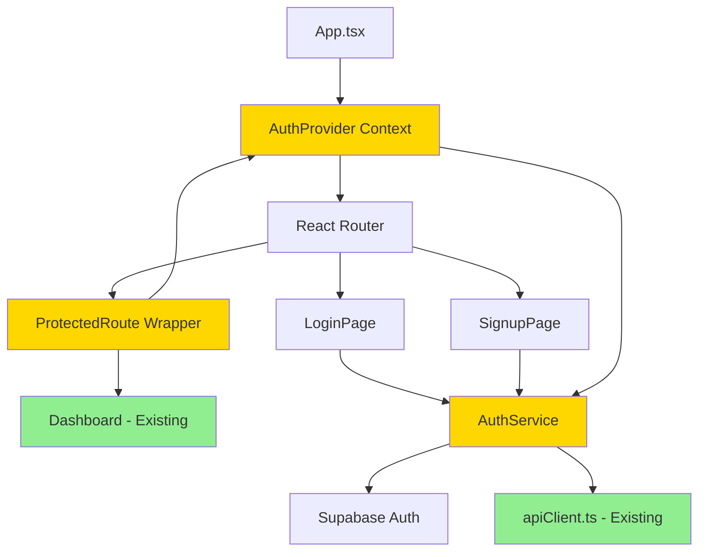

# 5. Component Architecture

## 5.1 New Components

### Component: AuthProvider (Context Provider)

**Responsibility:** Gerencia estado de autenticação global da aplicação

**Integration Points:**
- Wraps `<App>` component em `App.tsx`
- Fornece `AuthContext` para toda árvore de componentes
- Integra com `@supabase/supabase-js` para session management

**Key Interfaces:**
```typescript
interface AuthContextValue {
  user: User | null;
  session: Session | null;
  loading: boolean;
  signIn: (email: string, password: string) => Promise<void>;
  signUp: (email: string, password: string) => Promise<void>;
  signOut: () => Promise<void>;
  isAuthenticated: boolean;
}
```

**Dependencies:**
- **Existing Components:** Nenhum (é root-level provider)
- **New Components:** AuthService (service layer)

**Technology Stack:** React Context API, @supabase/supabase-js, TanStack Query (para caching de user data)

---

### Component: LoginPage

**Responsibility:** UI para usuário fazer login com email/password

**Integration Points:**
- Route `/login` em React Router
- Redireciona para dashboard após login bem-sucedido
- Link para SignupPage

**Key Interfaces:**
```typescript
interface LoginFormData {
  email: string;
  password: string;
}
```

**Dependencies:**
- **Existing Components:** Radix UI Input, Button, Card components
- **New Components:** useAuth() hook

**Technology Stack:** React, TypeScript, Radix UI, React Hook Form, Zod (validation)

---

### Component: SignupPage

**Responsibility:** UI para usuário criar conta com email/password

**Integration Points:**
- Route `/signup` em React Router
- Form validation com Zod schema
- Redireciona para dashboard após signup

**Key Interfaces:**
```typescript
interface SignupFormData {
  email: string;
  password: string;
  confirmPassword: string;
}
```

**Dependencies:**
- **Existing Components:** Radix UI components
- **New Components:** useAuth() hook

**Technology Stack:** React, TypeScript, React Hook Form, Zod validation

---

### Component: ProtectedRoute

**Responsibility:** Wrapper component que protege rotas requerendo autenticação

**Integration Points:**
- Wraps rotas protegidas em React Router
- Redireciona para /login se usuário não autenticado
- Permite acesso se `AUTH_ENABLED=false` (backward compatibility)

**Key Interfaces:**
```typescript
interface ProtectedRouteProps {
  children: React.ReactNode;
  fallback?: React.ReactNode;
}
```

**Dependencies:**
- **Existing Components:** React Router `Navigate`
- **New Components:** useAuth() hook

**Technology Stack:** React, React Router, TanStack Query

---

### Component: AuthService (Service Layer)

**Responsibility:** Abstração sobre Supabase Auth client para operações de autenticação

**Integration Points:**
- Usado por AuthProvider e auth hooks
- Integra com apiClient.ts para injetar tokens
- Persiste session no localStorage (configurável)

**Key Interfaces:**
```typescript
interface AuthService {
  signIn(email: string, password: string): Promise<AuthResponse>;
  signUp(email: string, password: string): Promise<AuthResponse>;
  signOut(): Promise<void>;
  getSession(): Promise<Session | null>;
  refreshSession(): Promise<Session>;
  onAuthStateChange(callback: (session: Session | null) => void): Unsubscribe;
}
```

**Dependencies:**
- **Existing Components:** apiClient.ts (para adicionar interceptor)
- **New Components:** @supabase/supabase-js client

**Technology Stack:** TypeScript, @supabase/supabase-js

---

## 5.2 Component Interaction Diagram



**Legend:**
- 🟢 Green: Existing components (unchanged)
- 🟡 Yellow: New auth components

---
